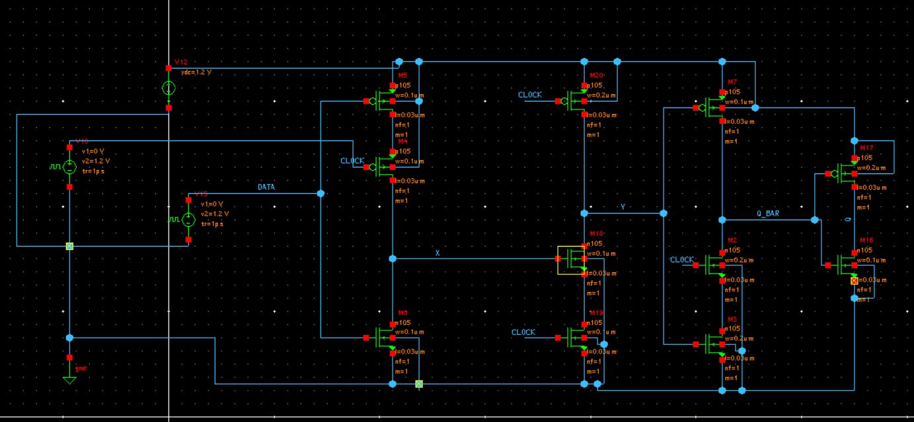
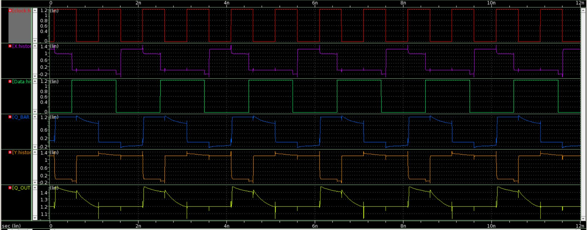
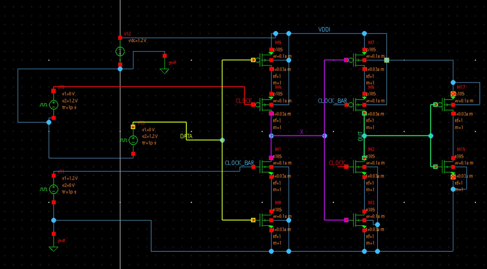
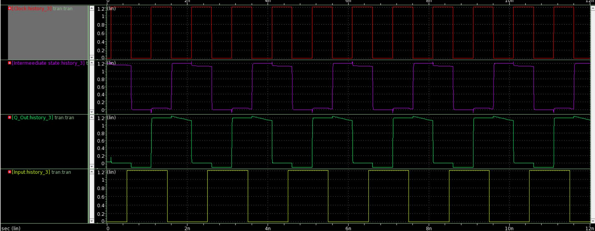

# Analog-Design-Hackathon

# Dynamic flip flop

True single phase D flip flop and C2MOS based flip flop are designed using 28nm technology

## TRUE Single Phase D Flip Flop

Following is circuit schemtic of TSPC DFF on Synopsys tool

Following is output of TSPC DFF on Synopsys tool

Following is circuit schemtic of C2MOS DFF on Synopsys tool

Following is output of C2MOS DFF on Synopsys tool

Conclusion 
Both TSPC based DFF and C2MOS based DFF are not stable for low level technologies and have leakage probles.
Benifit of TSPC is thet it need only one clock, C2MOS need 2 clock and clock bar.

